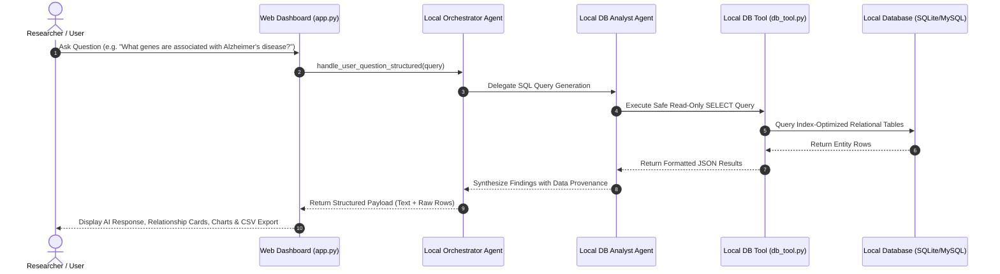

# Local Biomedical Multi-Agent System (PrimeKG Data)

[](https://www.python.org/)
[](https://streamlit.io/)
[](https://www.mysql.com/)
[](LICENSE)
[]()

> A **100% local, offline-capable biomedical multi-agent system and analytics dashboard** designed for precision medicine research. Integrates primary biomedical knowledge datasets from **PrimeKG** into a relational data warehouse and uses specialized AI agents for natural-language-to-SQL translation, evidence retrieval, and biomarker analysis.

---

## Key Features

- **Professional Web Dashboard & Analytics UI (`app.py`)**: Presentation-ready dark theme interface featuring dynamic KPI stat cards, interactive query execution, visual relationship triples, analytical data charts, and 1-click CSV exports.
- **Zero Emojis**: Clean, formal scientific presentation suitable for demonstrations to research mentors and biomedical informatics teams.
- **100% Local & Offline Execution**: Zero cloud API fees, no AWS credentials required. Runs entirely on local Python and local relational databases (SQLite / MySQL).
- **Space-Optimized Storage**: Stores **over 150,000 biomedical relationships in under 3.7 GB total disk space**.
- **Multi-Agent Architecture**: Inspired by AWS's Cancer Biomarker Discovery design pattern, refactored with 0% cloud dependencies:
  - **Supervisor Orchestrator**: Intent routing and multi-turn session management.
  - **Database Analyst Agent**: Schema introspection & safe Text-to-SQL query generation.
  - **Biomarker Specialist Agent**: Provenance tracking & biological evidence synthesis.
- **Safe Read-Only Querying**: Parameterized execution that strictly prevents data mutation (`INSERT`, `UPDATE`, `DELETE`, `DROP` forbidden).

---

## System Architecture



---

## Integrated Data Sources

Data derived from primary constituent resources of **PrimeKG** (Precision Medicine Knowledge Graph):

| Resource | Primary Entities | Relationship Type | Size on Disk | Records | Provenance |
| :--- | :--- | :--- | :---: | :---: | :---: |
| **CTD** | Genes, Diseases | `associated_with_disease` | 3,065.71 MB | 4,041,411 | Public Domain |
| **Reactome** | Pathways, Species | `pathway_mapping` | 1.52 MB | 23,603 | CC0 |
| **HPO** | Diseases, Phenotypes | `has_phenotype` | 34.16 MB | 286,652 | CC BY 4.0 |
| **SIDER** | Drugs, Side Effects | `causes_side_effect` | 2.27 MB | 309,849 | CC BY-NC 4.0 |
| **SIDER Names**| Drugs | `drug_name_mapping` | 0.03 MB | 1,430 | CC BY-NC 4.0 |
| **Gene Ontology**| Genes, Functions | `has_go_function` | 14.35 MB | 906,445 | CC BY 4.0 |

---

## Quick Start

### 1. Install Dependencies
```bash
pip install -r requirements.txt
```

### 2. Launch Local Web Dashboard UI
Launch the interactive Streamlit web dashboard:

```bash
streamlit run app.py
```

Open your browser to `http://localhost:8501`.

### 3. Launch Interactive Command-Line Interface (CLI)
Alternatively, run the command-line chat script:
```bash
python3 chat.py
```

---

## Project Structure

```text
local-biomedical-multiagent-primekg/
├── app.py                    # Streamlit Biomedical Analytics Dashboard & UI
├── chat.py                   # Interactive user chat CLI
├── HOW_TO_USE.md             # Easy user guide & output interpretation
├── requirements.txt          # Python dependencies (including Streamlit)
├── scripts/
│   ├── download_datasets.py  # Streaming dataset downloader & inventory generator
│   └── parse_and_prepare_data.py # Data ETL & SQLite/MySQL database ingestion
├── src/
│   ├── agents/
│   │   ├── orchestrator.py   # Master supervisor orchestrator (text & structured APIs)
│   │   ├── db_agent.py       # Database Analyst agent (Text-to-SQL)
│   │   └── biomarker_agent.py# Biomarker Specialist agent
│   └── tools/
│       └── db_tool.py        # Safe read-only database query tool with stats API
├── reports/
│   ├── data_inventory.md     # Downloaded dataset metrics report
│   ├── biomarker_scripts_analysis.md # AWS code analysis & local mapping
│   ├── mysql_schema_proposal.md     # Relational database schema design DDL
│   └── ui_documentation.md          # Web dashboard architecture & test report
└── data/
    ├── raw/                  # Downloaded raw TSV/GZ datasets
    └── processed/            # MySQL initialization DDL (init_biomedical_db.sql)
```

---

## License & Attribution

- Built as a **Local Biomedical AI System** using constituent datasets from [PrimeKG](https://github.com/mims-harvard/PrimeKG).
- Multi-agent workflow inspired by [AWS Healthcare & Life Sciences Samples](https://github.com/aws-samples/amazon-bedrock-agents-healthcare-lifesciences).
- Released under the [MIT License](LICENSE).
